# [📈 Anlık Durum](https://seyitacar.github.io/websitestatus): <!--live status--> **Kısmi Kesinti**

This repository contains the open-source uptime monitor and status page for [Seyit Acar](https://seyitacar.github.io/websitestatus), powered by [Upptime](https://github.com/upptime/upptime).

With [Upptime](https://upptime.js.org), you can get your own unlimited and free uptime monitor and status page, powered entirely by a GitHub repository. We use [Issues](https://github.com/seyitacar/websitestatus/issues) as incident reports, [Actions](https://github.com/seyitacar/websitestatus/actions) as uptime monitors, and [Pages](https://seyitacar.github.io/websitestatus) for the status page.

## [📈 Live Status](https://demo.upptime.js.org): <!--live status--> **Kısmi Kesinti**

<!--start: status pages-->
<!-- This summary is generated by Upptime (https://github.com/upptime/upptime) -->
<!-- Do not edit this manually, your changes will be overwritten -->
<!-- prettier-ignore -->
| Link | Durum | Geçmiş | Yanıt Süresi | Çevrimiçi Süresi |
| --- | ------ | ------- | ------------- | ------ |
|  [Noords](https://noords.com.tr/) | Çevrimiçi | [noords.yml](https://github.com/seyitacar/websitestatus/commits/HEAD/history/noords.yml) | 

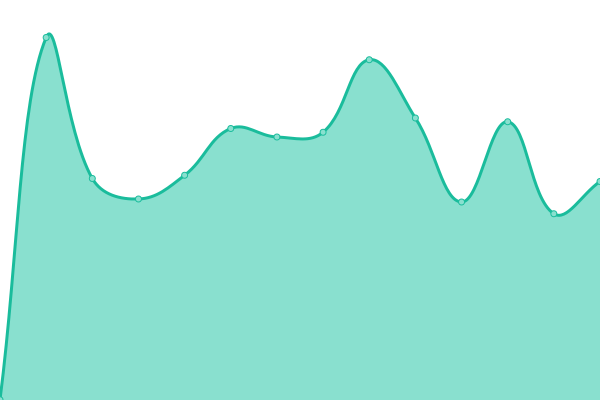 1168ms
     
 | 

<a href="https://seyitacar.github.io/websitestatus/history/noords">100.00%</a>
    

|  [Ghacielle](https://ghacielle.com/) | Çevrimiçi | [ghacielle.yml](https://github.com/seyitacar/websitestatus/commits/HEAD/history/ghacielle.yml) | 

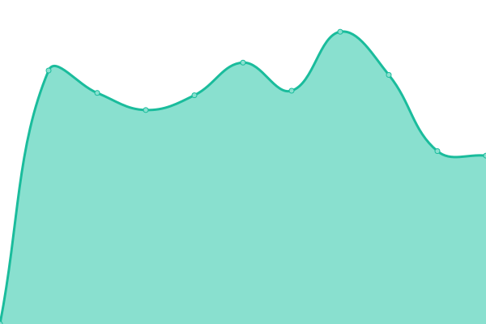 1870ms
     
 | 

<a href="https://seyitacar.github.io/websitestatus/history/ghacielle">100.00%</a>
    

|  [Hendesitezyinat](https://hendesitezyinat.com/) | Çevrimiçi | [hendesitezyinat.yml](https://github.com/seyitacar/websitestatus/commits/HEAD/history/hendesitezyinat.yml) | 

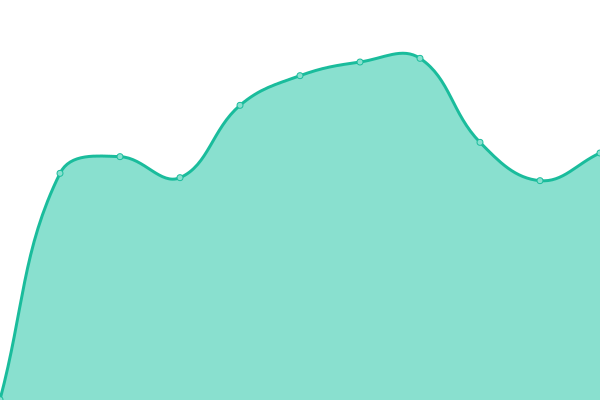 705ms
     
 | 

<a href="https://seyitacar.github.io/websitestatus/history/hendesitezyinat">100.00%</a>
    

|  [Needle](https://needle.tr/) | Çevrimiçi | [needle.yml](https://github.com/seyitacar/websitestatus/commits/HEAD/history/needle.yml) | 

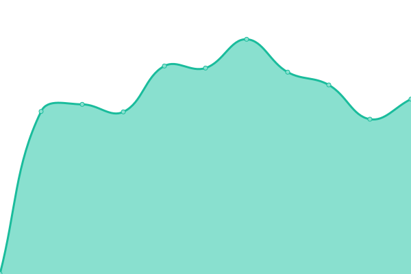 728ms
     
 | 

<a href="https://seyitacar.github.io/websitestatus/history/needle">100.00%</a>
    

|  [Uppermind](https://uppermind.ai/) | Çevrimiçi | [uppermind.yml](https://github.com/seyitacar/websitestatus/commits/HEAD/history/uppermind.yml) | 

 770ms
     
 | 

<a href="https://seyitacar.github.io/websitestatus/history/uppermind">100.00%</a>
    

|  [Evcilim](https://evcil.im/) | Çevrimiçi | [evcilim.yml](https://github.com/seyitacar/websitestatus/commits/HEAD/history/evcilim.yml) | 

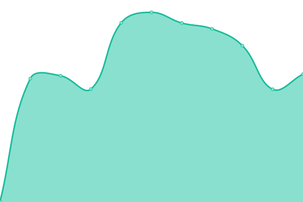 618ms
     
 | 

<a href="https://seyitacar.github.io/websitestatus/history/evcilim">100.00%</a>
    

|  [Minihol](https://minihol.com/) | Çevrimiçi | [minihol.yml](https://github.com/seyitacar/websitestatus/commits/HEAD/history/minihol.yml) | 

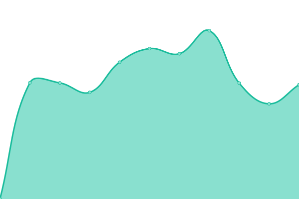 701ms
     
 | 

<a href="https://seyitacar.github.io/websitestatus/history/minihol">100.00%</a>
    

|  [Galia Tasarım](https://galiatasarim.com/) | Çevrimiçi | [galia-tasarim.yml](https://github.com/seyitacar/websitestatus/commits/HEAD/history/galia-tasarim.yml) | 

 883ms
     
 | 

<a href="https://seyitacar.github.io/websitestatus/history/galia-tasarim">100.00%</a>
    

|  [Aile Yayınları](https://aileyayinlari.com/) | Çevrimiçi | [aile-yayinlari.yml](https://github.com/seyitacar/websitestatus/commits/HEAD/history/aile-yayinlari.yml) | 

 243ms
     
 | 

<a href="https://seyitacar.github.io/websitestatus/history/aile-yayinlari">100.00%</a>
    

|  [Samist Technic](https://samistechnic.com/) | Çevrimiçi | [samist-technic.yml](https://github.com/seyitacar/websitestatus/commits/HEAD/history/samist-technic.yml) | 

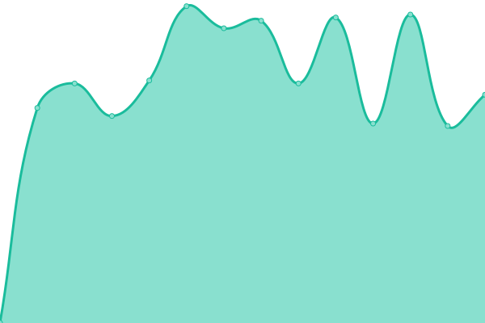 845ms
     
 | 

<a href="https://seyitacar.github.io/websitestatus/history/samist-technic">100.00%</a>
    

|  [Fovist](https://fovist.com/) | Çevrimiçi | [fovist.yml](https://github.com/seyitacar/websitestatus/commits/HEAD/history/fovist.yml) | 

 844ms
     
 | 

<a href="https://seyitacar.github.io/websitestatus/history/fovist">100.00%</a>
    

|  [Bilmeceler](https://bilmeceler.tr/) | Çevrimiçi | [bilmeceler.yml](https://github.com/seyitacar/websitestatus/commits/HEAD/history/bilmeceler.yml) | 

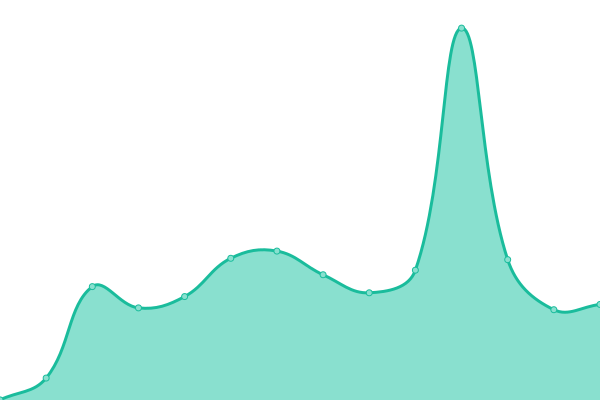 592ms
     
 | 

<a href="https://seyitacar.github.io/websitestatus/history/bilmeceler">100.00%</a>
    

|  [Hikmet Ağacı](https://hikmetagaci.com/) | Çevrimiçi | [hikmet-agaci.yml](https://github.com/seyitacar/websitestatus/commits/HEAD/history/hikmet-agaci.yml) | 

 271ms
     
 | 

<a href="https://seyitacar.github.io/websitestatus/history/hikmet-agaci">100.00%</a>
    

|  [NFA Hukuk Danışmanlık](https://nfahukukdanismanlik.com/) | Çevrimiçi | [nfa-hukuk-danismanlik.yml](https://github.com/seyitacar/websitestatus/commits/HEAD/history/nfa-hukuk-danismanlik.yml) | 

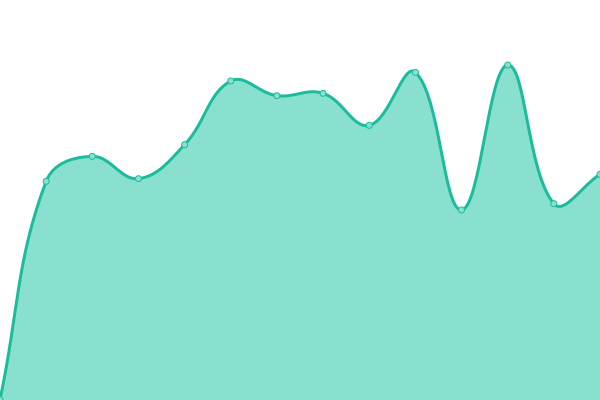 694ms
     
 | 

<a href="https://seyitacar.github.io/websitestatus/history/nfa-hukuk-danismanlik">100.00%</a>
    

|  [ideal IDM](https://idealidm.com/) | Çevrimiçi | [ideal-idm.yml](https://github.com/seyitacar/websitestatus/commits/HEAD/history/ideal-idm.yml) | 

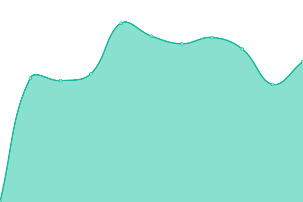 971ms
     
 | 

<a href="https://seyitacar.github.io/websitestatus/history/ideal-idm">100.00%</a>
    

|  [Mobil Yaka](https://mobilyaka.com/) | Çevrimiçi | [mobil-yaka.yml](https://github.com/seyitacar/websitestatus/commits/HEAD/history/mobil-yaka.yml) | 

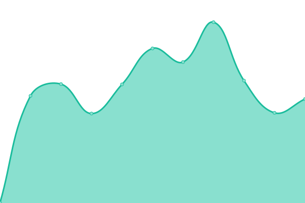 780ms
     
 | 

<a href="https://seyitacar.github.io/websitestatus/history/mobil-yaka">100.00%</a>
    

|  [Data Market](https://www.datamarket.com.tr/) | Kesinti | [data-market.yml](https://github.com/seyitacar/websitestatus/commits/HEAD/history/data-market.yml) | 

 0ms
     
 | 

<a href="https://seyitacar.github.io/websitestatus/history/data-market">0.43%</a>
    

|  [Bazen Defter](https://bazendefter.com/) | Çevrimiçi | [bazen-defter.yml](https://github.com/seyitacar/websitestatus/commits/HEAD/history/bazen-defter.yml) | 

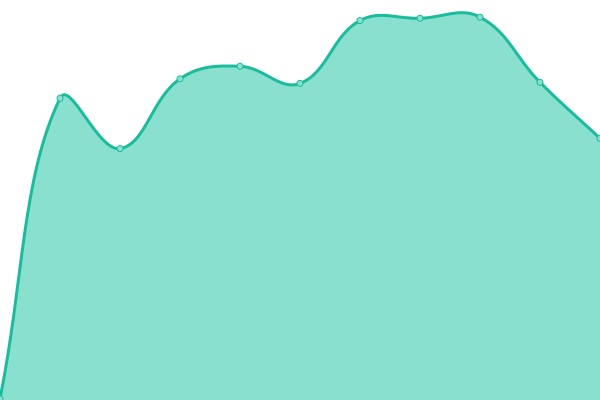 242ms
     
 | 

<a href="https://seyitacar.github.io/websitestatus/history/bazen-defter">100.00%</a>
    

|  [Cepport](https://cepport.com.tr/) | Çevrimiçi | [cepport.yml](https://github.com/seyitacar/websitestatus/commits/HEAD/history/cepport.yml) | 

 709ms
     
 | 

<a href="https://seyitacar.github.io/websitestatus/history/cepport">100.00%</a>
    

|  [Witcher Gelen E-posta](witcher.mxrouting.net) | Çevrimiçi | [witcher-gelen-e-posta.yml](https://github.com/seyitacar/websitestatus/commits/HEAD/history/witcher-gelen-e-posta.yml) | 

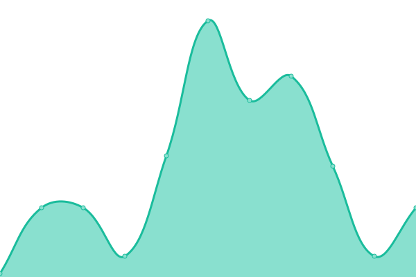 20ms
     
 | 

<a href="https://seyitacar.github.io/websitestatus/history/witcher-gelen-e-posta">100.00%</a>
    

|  [Witcher Giden E-posta](witcher.mxrouting.net) | Çevrimiçi | [witcher-giden-e-posta.yml](https://github.com/seyitacar/websitestatus/commits/HEAD/history/witcher-giden-e-posta.yml) | 

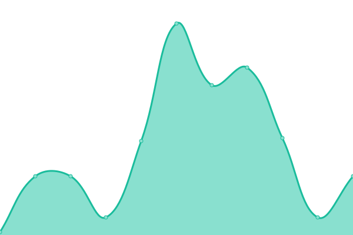 20ms
     
 | 

<a href="https://seyitacar.github.io/websitestatus/history/witcher-giden-e-posta">100.00%</a>
    

|  [Pixel Gelen E-posta](pixel.mxrouting.net) | Çevrimiçi | [pixel-gelen-e-posta.yml](https://github.com/seyitacar/websitestatus/commits/HEAD/history/pixel-gelen-e-posta.yml) | 

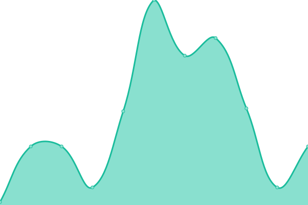 20ms
     
 | 

<a href="https://seyitacar.github.io/websitestatus/history/pixel-gelen-e-posta">100.00%</a>
    

|  [Pixel Giden E-posta](pixel.mxrouting.net) | Çevrimiçi | [pixel-giden-e-posta.yml](https://github.com/seyitacar/websitestatus/commits/HEAD/history/pixel-giden-e-posta.yml) | 

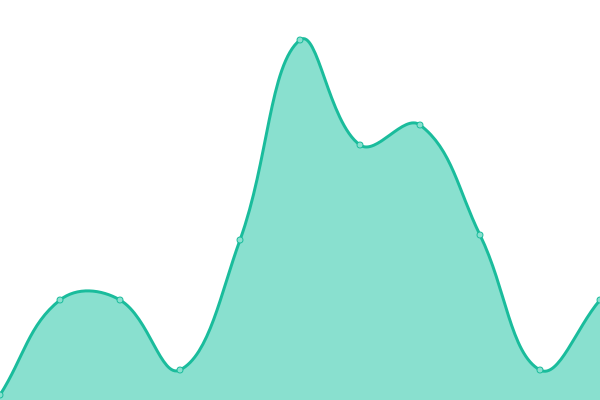 20ms
     
 | 

<a href="https://seyitacar.github.io/websitestatus/history/pixel-giden-e-posta">100.00%</a>
    

<!--end: status pages-->

[**Visit our status website →**](https://seyitacar.github.io/websitestatus)

## 📄 License

- Powered by: [Upptime](https://github.com/upptime/upptime)
- Code: [MIT](./LICENSE) © [Anand Chowdhary](https://anandchowdhary.com), supported by [Pabio](https://pabio.com)
- Data in the `./history` directory: [Open Database License](https://opendatacommons.org/licenses/odbl/1-0/)
